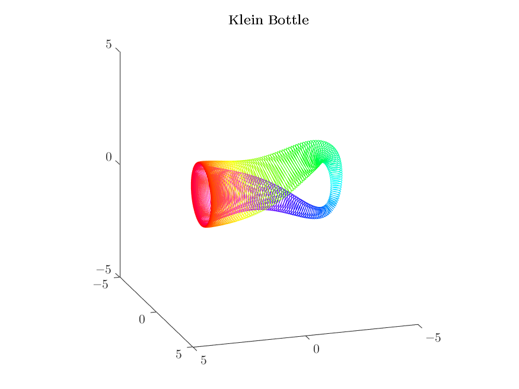

# Klein Bottle in the Time Domain
​	This animation reveals how the neck of a Klein Bottle "pass through" itself by using time as the fourth dimension.

​	The bottle is then cut off a half to show that a Klein Bottle consists of two Möbius rings.

